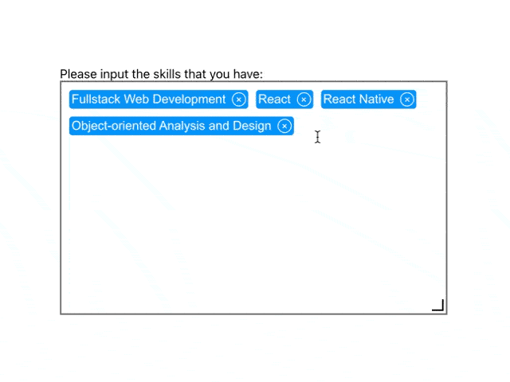

# react-tagarea

A react component used to input tag like data.

# Installation

1. Install react-tagarea

    `yarn add @mattzgg/react-tagarea`

2. Install the peer dependencies

    `yarn add react react-dom prop-types lodash styled-components`

# Demo

```javascript
import React, { useState } from "react";
import Tagarea from "@mattzgg/react-tagarea";
import "./App.css";

function App() {
    const [tags, setTags] = useState([
        {
            text: "Fullstack Web Development",
            value: "1",
        },
        {
            text: "React",
            value: "2",
        },
        {
            text: "React Native",
            value: "3",
        },
        {
            text: "Object-oriented Analysis and Design",
            value: "4",
        },
    ]);
    const [appearanceConfig, setAppearanceConfig] = useState(
        Tagarea.defaultProps.appearanceConfig
    );
    const onAddTag = (newTag) => {
        setTags([...tags, newTag]);
    };
    const onDeleteTag = (deletedTagIndex) => {
        setTags(tags.filter((tag, index) => index !== deletedTagIndex));
    };
    const onResize = (newAppearanceConfig) => {
        setAppearanceConfig(newAppearanceConfig);
    };
    return (
        <div className="App">
            <div>
                <label htmlFor="skills">
                    Please input the skills that you have:
                </label>
                <Tagarea
                    name="skills"
                    tags={tags}
                    appearanceConfig={appearanceConfig}
                    onAddTag={onAddTag}
                    onDeleteTag={onDeleteTag}
                    onResize={onResize}
                />
            </div>
        </div>
    );
}

export default App;
```


